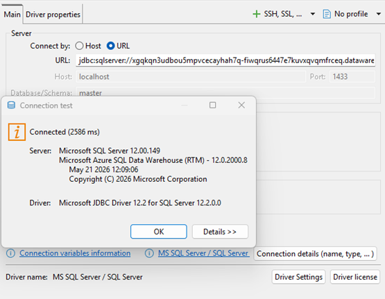

# 📘 Connexió a Microsoft Fabric Lakehouse SQL Endpoint mitjançant JDBC

Aquest document explica com connectar-se al **SQL Endpoint d’un Lakehouse a Microsoft Fabric** utilitzant **JDBC**.

---

## 📂 Contingut
- Requisits  
- Cadena de connexió JDBC  
- Exemple d’ús  
- Exemple de valors  

---

## 🔧 Requisits

Abans de començar, assegura’t de tenir:

- Accés a Microsoft Fabric  
- Un Lakehouse amb el SQL Endpoint habilitat  
- Driver JDBC de SQL Server (`mssql-jdbc-<versió>.jar`)  
- Credencials d’un Service Principal:
  - Client ID  
  - Client Secret  
  - Tenant ID (segons l’entorn)

---

## 🔗 Cadena de connexió JDBC

La URL de connexió JDBC per al SQL Endpoint de Microsoft Fabric és la següent:

```text
jdbc:sqlserver://{SERVER_NAME}:1433;
databaseName={DATABASE_NAME};
authentication=ActiveDirectoryServicePrincipal;
user={SERVICE_PRINCIPAL_CLIENT_ID};
password={SERVICE_PRINCIPAL_CLIENT_SECRET};
encrypt=true;
trustServerCertificate=false;
```

### 🔍 Paràmetres

- `SERVER_NAME`: URL del SQL Endpoint de Fabric  
- `DATABASE_NAME`: nom del Lakehouse  
- `SERVICE_PRINCIPAL_CLIENT_ID`: Client ID del Service Principal  
- `SERVICE_PRINCIPAL_CLIENT_SECRET`: Client Secret del Service Principal  
- `authentication=ActiveDirectoryServicePrincipal`: mètode d’autenticació  
- `encrypt=true`: habilita el xifrat  
- `trustServerCertificate=false`: valida el certificat del servidor  

---

## 🧩 Exemple d’ús

Exemple genèric d’ús de la cadena de connexió con JDBC:


---

## 📂 Exemple de valors

- **SERVER_NAME**:  
  `xgqkqn3udbou5mpvcecayhah7q-hr43b7ttdlwutldvr36wzajgva.datawarehouse.fabric.microsoft.com`

- **DATABASE_NAME**:  
  `lakehouse_gold`

- **SERVICE_PRINCIPAL_CLIENT_ID**:  
  `xxxxxxxx-xxxx-xxxx-xxxx-xxxxxxxxxxxx`

- **SERVICE_PRINCIPAL_CLIENT_SECRET**:  
  `xxxxxxxxxxxxxxxxxxxxxxxx`

---

✅ Amb aquesta configuració podràs connectar-te directament al SQL Endpoint de Microsoft Fabric utilitzant JDBC amb autenticació basada en Service Principal.
