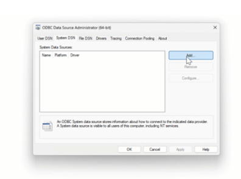
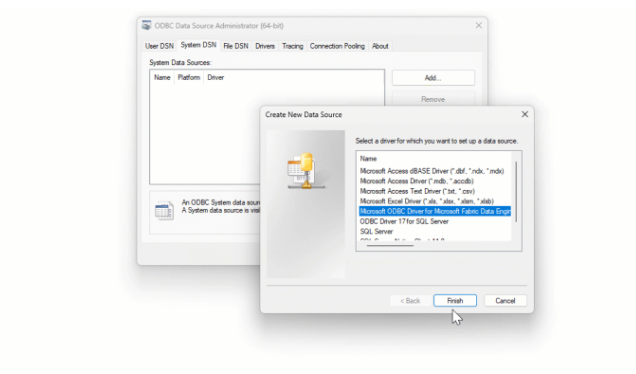
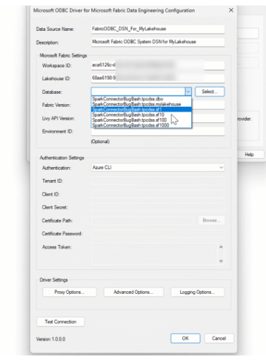

# 📘 Conexión por ODBC al SQL Endpoint de Microsoft Fabric

Aquest document explica com connectar-se mitjançant **ODBC** al SQL Endpoint d’un Lakehouse a Microsoft Fabric, utilitzant autenticació d’Azure Active Directory (AAD).


Inclou:
- Requisits previs
- Obtenció del SQL Endpoint
- Instal·lació del driver i llibreries
- Connexió via ODBC i execució de consultes

---
## 📂 Contingut
- Requisits
- Instal·lació del Driver ODBC
- Obtenció de la URL del SQL Endpoint
- Autenticació mitjançant Azure AD
- Connexió ODBC i exemple de consulta
- Valors d’exemple

---
## 🔧 Requisits
- Accés a un **workspace de Microsoft Fabric**
- Un **Lakehouse** amb el SQL Endpoint habilitat
- Driver **ODBC 18 for SQL Server**

---
## 🛠️ Instal·lació del Driver ODBC

### **Windows**
```bash
https://learn.microsoft.com/es-es/sql/connect/odbc/download-odbc-driver-for-sql-server?view=sql-server-ver17
```


---
## 🔧 Obtenció del SQL Endpoint del Lakehouse
1. Obre la **Microsoft Fabric App**: https://app.fabric.microsoft.com  
2. Entra  al **Lakehouse**.  
3. Ves a **Settings → SQL Endpoint**.  
4. Copia:
   - **Server URL**
   - **Database name**

---
## 📦 Prova de connexió







---
## 📂 Exemple de valors de configuració
- **TENANT_ID:** `37a8a0b9-1874-4e5d-b1f5-11040c1c07fc`
- **SERVER:** `xxxxxxx.datawarehouse.fabric.microsoft.com`
- **DATABASE:** `lakehouse_gold`

