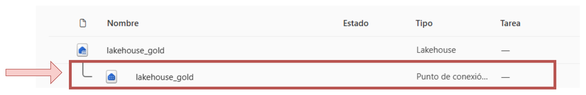
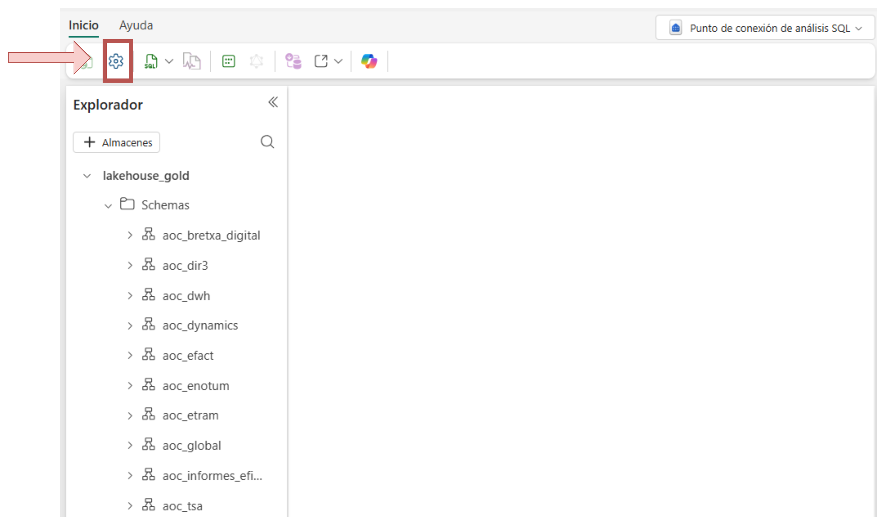
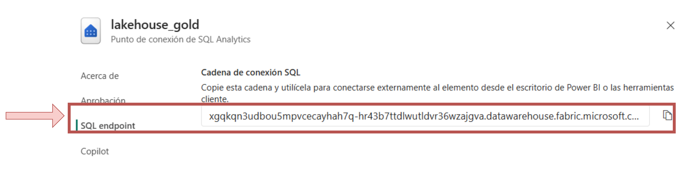
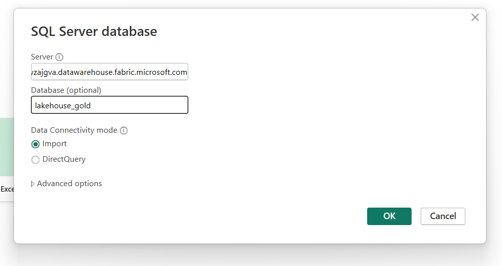
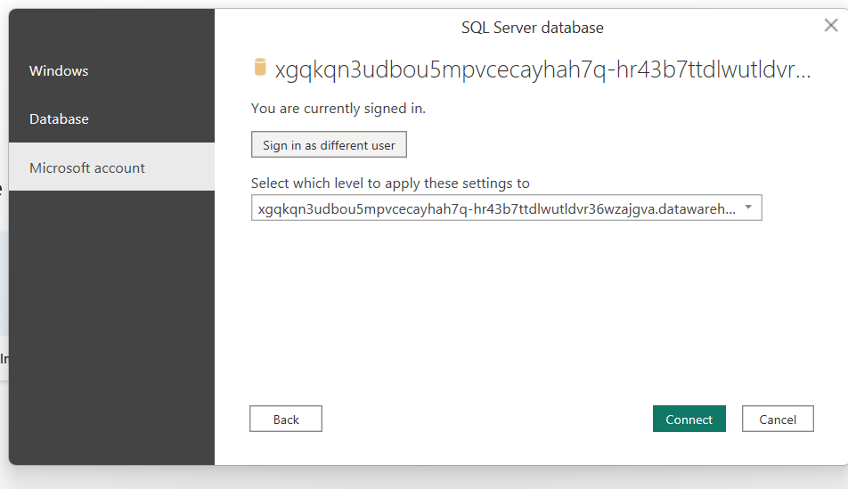

# Connectar-se al Data Lake des de Power BI Desktop a un SQL Endpoint

Aquest instructiu explica com connectar Power BI Desktop a un SQL Analytics Endpoint de Microsoft Fabric.

## 1. Requisits previs
- Power BI Desktop instal·lat.
- Permisos sobre el Lakehouse/Warehouse.

## 2. Obtenir el SQL Endpoint
1. Obre l'àrea de treball de Microsoft Fabric a la qual et vols connectar ( [Fabric App](https://app.fabric.microsoft.com/) ).
2. Obre el Lakehouse al qual vols connectar-te, ves a Configuració → Punt de Connexió d'Anàlisi SQL (SQL endpoint en anglès).
3. Copia la URL i el nom del Lakehouse.

## 3. Connectar-se des de Power BI Desktop
1. Obre Power BI Desktop.
2. Get Data → SQL Server.
3. Server: `<FQDN-endpoint>`. Utilitza la URL del punt de connexió copiada anteriorment.
4. Database: `<LakehouseName>`. Nom del Lakehouse copiat anteriorment.
5. Tria Import o DirectQuery.

## 4. Autenticació
Tria Microsoft Account i inicia sessió amb el compte corresponent.

## 5. Seleccionar taules
Selecciona les taules necessàries.

## 6. Problemes comuns
- Verificar permisos.
- Confirmar el nom correcte del Lakehouse.
- Comprovar la URL del punt de connexió SQL.

## 7. Exemple de valors
Server: `xxxx.datawarehouse.fabric.microsoft.com`
Database: `lakehouse_gold`
