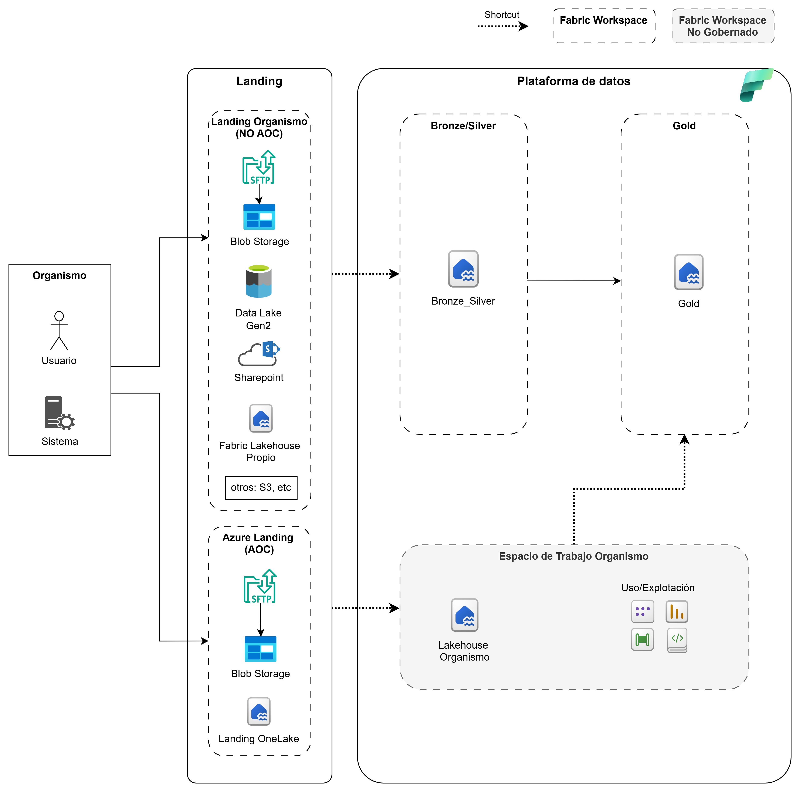

# Integració amb la Capa Landing de l’AOC

Aquest repositori descriu les **dues opcions disponibles perquè els organismes integrin dades amb la capa Landing de l’AOC**, segons es mostra al diagrama d’arquitectura. Ambdues opcions permeten la ingesta de dades cap a la plataforma corporativa, però difereixen en el **grau de governança, responsabilitats i control**.

---

## Diagrama d’Arquitectura

---

## Visió general

L’arquitectura distingeix entre:

- **Landing de l’Organisme (No AOC)**  
- **Landing Azure AOC (Governada)**  

Ambdues rutes permeten alimentar la **Plataforma de Dades** (Bronze/Silver/Gold) i els **espais de treball de l’organisme**, però amb diferents nivells d’estandardització i control per part de l’AOC.

## Ús de Shortcuts a OneLake

Un dels objectius principals del model d’integració amb la capa Landing és minimitzar còpies innecessàries de dades, respectar la sobirania del dada dels organismes i, alhora, facilitar una visió unificada de la informació dins la plataforma corporativa.
Per aconseguir-ho, la plataforma fa ús de Shortcuts de OneLake, una funcionalitat nativa de Microsoft Fabric que permet connectar dades existents sense haver-les de moure físicament.

### Què és un Shortcut
Un shortcut és un accés virtual dins de OneLake que apunta a una ubicació de dades existent, ja sigui dins del mateix OneLake o en sistemes externs.
Funciona de manera similar a un enllaç simbòlic, de manera que:

La dada continua residint en el seu origen.
És visible i consumible des de Fabric com si fos local.
No es genera cap còpia física de la informació.

Aquest enfocament permet reduir latència, costos d’emmagatzematge i complexitat operativa, al mateix temps que s’ofereix una experiència homogènia als equips analítics.

### Tipus de Shortcuts disponibles actualment
A data d’avui, Microsoft Fabric permet crear shortcuts cap als següents tipus d’orígens:
- OneLake (intern): accés a dades ubicades en altres workspaces o lakehouses.
- Azure Data Lake Storage Gen2
- Azure Blob Storage
- Amazon S3
- SharePoint / OneDrive
- Altres orígens compatibles que es van incorporant progressivament dins l’ecosistema Fabric.

Aquesta varietat permet adaptar-se tant a arquitectures cloud natives com a escenaris híbrids o multicloud.

### Documentació oficial de Microsoft
Microsoft actualitza de manera contínua els tipus d’orígens suportats i les capacitats dels shortcuts.
Es recomana consultar la documentació oficial per validar noves integracions disponibles o canvis de comportament:
OneLake shortcuts – Microsoft Learn
https://learn.microsoft.com/en-us/fabric/onelake/onelake-shortcuts [learn.microsoft.com]

---

## Opció 1: Integració mitjançant la *Azure Landing AOC* (Governada)

### Descripció

En aquesta opció, l’organisme utilitza la **Landing corporativa de l’AOC a Azure**, dissenyada per oferir un model **estàndard, governat i alineat amb Fabric i OneLake**.

### Components clau

- **SFTP gestionat per l’AOC**  
- **Azure Blob Storage**  
- **Landing a OneLake**

Aquests components formen part d’una Landing comuna i governada, preparada per integrar-se de manera nativa amb la plataforma de dades.

### Flux de dades

1. L’organisme diposita les dades directament a la **Landing AOC**.
2. Les dades s’incorporen automàticament als fluxos de la plataforma:
   - Bronze / Silver
   - Gold
3. Les dades poden ser explotades des de:
   - Gold corporatiu
   - Lakehouse de l’organisme a Fabric

### Responsabilitats

- L’**AOC** proporciona:
  - Infraestructura
  - Estàndards d’ingesta
  - Seguretat i govern del dada
- L’**organisme** es focalitza en:
  - Proveir les dades
  - Definir les regles de negoci i de consum

### Quan utilitzar aquesta opció

✅ Recomanada quan:
- Es busca alineació amb el model corporatiu de l’AOC.
- No existeix una Landing prèvia de l’organisme.

### Creació d’un shortcut a Microsoft Fabric per llegir dades des d’un compte de Storage Landing
Per accedir a les dades emmagatzemades en un compte de Storage des de Microsoft Fabric sense necessitat de duplicar-les, es pot crear un shortcut en un Lakehouse de l’espai de treball de Fabric.

El procés consisteix a accedir al Lakehouse de l’espai de treball corresponent, seleccionar l’opció Create shortcut i escollir com a origen **Azure Data Lake Storage Gen2**. A continuació, es configura la connexió indicant el compte d’emmagatzematge, el contenidor i la ruta on resideixen les dades. L’autenticació es realitza mitjançant Azure AD, utilitzant una identitat gestionada o un servei principal proporcionats.

Un cop creat, el shortcut actua com una referència lògica a les dades d’ADLS Gen2, permetent-ne la lectura directa des de Fabric (Spark, SQL o eines d’explotació) com si formessin part del Lakehouse, mantenint el govern de la dada i evitant la replicació innecessària de la informació.

---

## Opció 2: Integració mitjançant la *Landing de l’Organisme (No AOC)*

### Descripció

En aquesta opció, l’organisme manté la seva **pròpia capa Landing**, fora del perímetre directe de l’AOC. Les dades s’allotgen i es gestionen en infraestructures de l’organisme i posteriorment s’integren amb la plataforma de dades corporativa.

### Orígens de dades típics

La Landing de l’Organisme pot rebre dades des de múltiples fonts, com ara:

- Servidors **SFTP**  
- **Azure Blob Storage**  
- **Azure Data Lake Gen2**  
- **SharePoint**  
- **Fabric Lakehouse propi**  
- Altres orígens externs (per exemple, **Amazon S3**, etc.)

### Flux de dades

1. L’organisme ingesta les dades a la seva pròpia Landing.
2. S’estableixen processos de transferència o accés cap a la **zona Bronze/Silver** de la plataforma de dades.
3. Les dades evolucionen cap a **Gold** per al seu consum analític.

### Responsabilitats

- L’**organisme** és responsable de:
  - La ingesta inicial
  - La qualitat de les dades en origen
  - La seguretat i la gestió dels accessos
- L’**AOC** consumeix les dades disponibles per a la seva normalització i explotació.

### Quan utilitzar aquesta opció

✅ Recomanada quan:
- L’organisme ja disposa d’una Landing madura.
- Existeixen requisits de sobirania o control del dada.
- Es requereix flexibilitat tecnològica en la ingesta.

### Creació d’un shortcut a Microsoft Fabric per llegir dades des d’un compte de Storage Landing
Mateixos passos de creació de la drecera, opció 1

---

